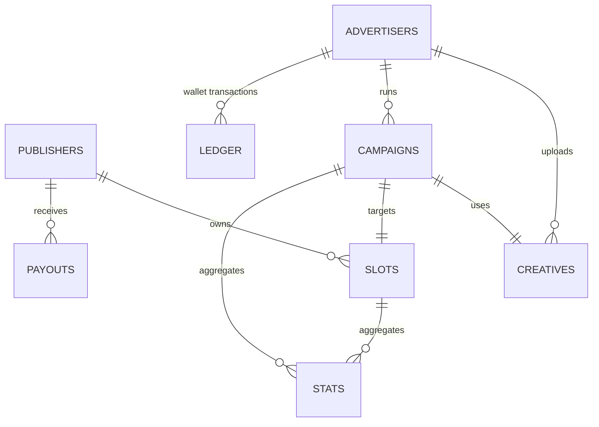
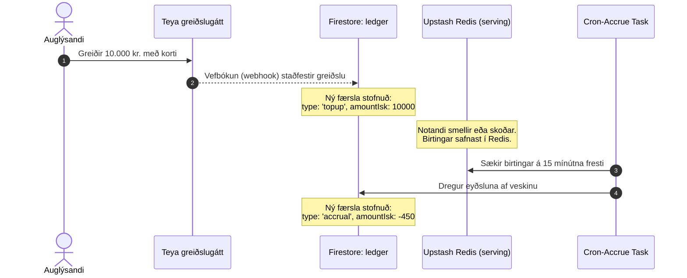

# Kerfishönnun og Gagnaskipulag (Architecture & Data Flow)

Þetta skjal lýsir innra skipulagi ADA vettvangsins, Firestore söfnunum (collections) og hvernig fjármagnsflæðið (Ledger/Wallet) virkar.

---

## 1. Gagnaskipulag (Firestore Collections)

Gagnagrunnurinn er hannaður í kringum 8 megin söfn (collections). Hér er tengslamynd og lýsing á þeim:

### Lýsing á söfnum (Collections):

1. **`publishers` (Útgefendur):**
   * Lykill: `id` (UUID eða sjálfvirkt)
   * Reitir: `ownerEmail` (auðkenning), `domain` (lén), `displayName`, `payoutMethod` (bankareikningur, kt), `contentPolicy` (bannaðir flokkar, handvirkt samþykki).
2. **`slots` (Auglýsingapláss):**
   * Lykill: `id`
   * Reitir: `publisherId` (tengir við publisher), `name`, `sizes` (IAB stærðir), `pricing` (`cpm` eða `flat` gjald), `targeting` (flokkar, landsvæði), `autoApprove` (sjálfvirkt samþykki auglýsinga).
3. **`advertisers` (Auglýsendur):**
   * Lykill: `id`
   * Reitir: `ownerEmail`, `companyName`, `kennitala`, `vatNumber` (VSK-númer), `billingEmail`.
4. **`creatives` (Auglýsingamyndir):**
   * Lykill: `id`
   * Reitir: `advertiserId`, `imageUrl`, `clickUrl`, `width`, `height`, `autoScanResult` (skönnunarniðurstaða frá Gemini), `status` (`pending`, `approved`, `rejected`).
5. **`campaigns` (Herferðir):**
   * Lykill: `id`
   * Reitir: `advertiserId`, `creativeId`, `slotId`, `name`, `budgetIsk`, `spentIsk`, `status` (`active`, `paused`, `completed`, `draft`), `startsAt`, `endsAt`.
6. **`ledger` (Bókhald/Innistæða veskis):**
   * Bókhaldsfærslur á append-only formi til að reikna út innistæðu auglýsenda.
   * Reitir: `advertiserId`, `amountIsk` (jákvætt fyrir innborgun, neikvætt fyrir eyðslu), `type` (`topup`, `accrual`, `refund`), `description`, `referenceId` (t.d. herferðarauðkenni eða Teya tilvísun).
7. **`payouts` (Útgreiðslur):**
   * Mánaðarlegar útgreiðslur til útgefenda.
   * Reitir: `publisherId`, `amountIsk` (heildarupphæð), `netIsk` (eftir 20% ADA þóknun), `status` (`pending`, `completed`), `bankReference` (bankakvitans færslunúmer).
8. **`stats` (Tölfræði):**
   * Tímabundin söfnun á smellum og birtingum.
   * Reitir: `slotId`, `campaignId`, `date` (klukkustund), `impressions`, `clicks`, `spendIsk`.

---

## 2. Fjármagnsflæði (Ledger & Wallet system)

Veski (Wallet) auglýsanda er reiknað út sem summa allra færslna í `ledger` safninu fyrir viðkomandi `advertiserId`. Þetta tryggir 100% rekjanleika og kemur í veg fyrir að peningar hverfi eða tvítelji.

### Accrual & Payout Regla:
1. **Accrual:** Cron keyrslan reiknar út heildarbirtingar í Redis á 15 mínútna fresti, reiknar eyðsluna (birtingar × CPM verð / 1000) og skrifar neikvæða færslu í `ledger`.
2. **Payout:** Um mánaðamót er keyrð `cron-payouts`. Hún dregur saman alla tölfræði útgefenda. 80% af heildartekjum plássanna rennur til útgefanda (`netIsk`), en 20% rennur til ADA vettvangsins sem þóknun.
